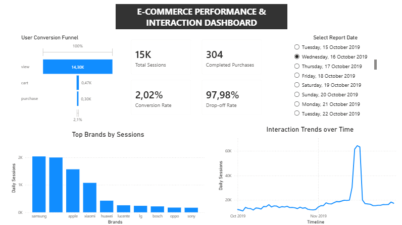

# E-Commerce Funnel & Conversion Analysis Dashboard

## Project Overview

This project focuses on analyzing user behavior across an e-commerce conversion funnel using Power BI.

The dashboard was created as part of a Data Science & Analytics internship project to identify customer drop-off points, monitor conversion performance, and generate business insights that can improve sales and marketing effectiveness.

---

## Objectives

The main objectives of this project were to:

- Analyze customer movement through the e-commerce funnel
- Measure conversion performance
- Identify major drop-off stages
- Track user interaction trends over time
- Compare session activity across brands
- Provide actionable business recommendations

---

## Tools & Technologies Used

- Power BI
- DAX
- Data Visualization
- Funnel Analytics
- KPI Reporting

---

## Key Metrics

The dashboard tracks:

- Total Sessions
- Completed Purchases
- Conversion Rate
- Funnel Drop-off Rate
- Brand Session Performance
- Interaction Trends Over Time

---

## Dashboard Features

### Conversion Funnel
Visualizes user progression from product views to purchases and highlights drop-off stages.

### KPI Tracking
Displays key business metrics including:
- Total Sessions
- Purchases
- Conversion Rate
- Drop-off Rate

### Brand Performance Analysis
Identifies brands generating the highest interaction volume.

### Trend Analysis
Tracks interaction trends and spikes over time.

---

## Key Insights

- Significant user drop-off occurs before purchase completion
- Samsung generated the highest session activity
- Interaction activity experienced major spikes during certain campaign periods
- Overall conversion rates remain low despite high traffic volume

---

## Recommendations

- Improve checkout and purchasing experience
- Retarget users who abandon carts
- Investigate high-traffic periods for successful marketing strategies
- Optimize low-converting funnel stages

---

## Dataset

Dataset used:
E-Commerce User Behavior Dataset (Kaggle)

---

## Dashboard Preview

---

## Author

Nikita Chetty

Data Science & Analytics Internship Project
